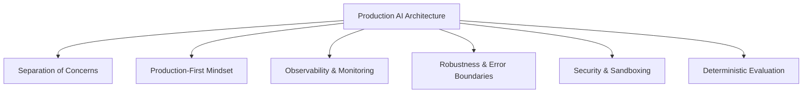

# System Architecture Overview

This section documents the high-level system architecture, design patterns, and engineering constraints adopted in the **Production AI Systems** repository.

Our core objective is to design systems that are resilient, scalable, observable, and easy to maintain in production environments.

---

## 📐 Core Architectural Principles

We structure our applications and experiments around six fundamental architectural pillars:

### 1. Separation of Concerns (SoC)
We strictly segregate distinct processing domains to ensure modularity:
- **LLM Prompting & Orchestration:** Abstracted behind specific wrapper modules.
- **Data Ingestion & Processing:** Kept isolated from model APIs to run independently.
- **Persistence (Vector DB / Cache):** Layered behind standard abstractions to facilitate swapping (e.g. ChromaDB to Qdrant).

### 2. Production-First Mindset
We avoid writing throwaway tutorial code. Every utility, tokenizer benchmark, or vector store query is implemented with a clear path to production:
- Use of environment configurations (`.env`).
- High modularity using Python packages.
- Strict typing and contracts validation.

### 3. Observability
Every component considers tracing, cost, and latency:
- Comprehensive logging via structured logs (`loguru`).
- Preparation for external LLM trace engines (Phoenix / LangSmith).
- Calculation of token consumption and API operational costs.

### 4. Robustness
AI operations are inherently non-deterministic. Our designs protect the system boundary by implementing:
- Context window budgeting.
- Strict schema validation via `Pydantic` to enforce type safety on unstructured outputs.
- Retry mechanisms with exponential backoff for network-bound LLM API calls.

### 5. Security
All projects are built with safety constraints:
- Centralized secrets management (avoiding plain-text API keys in notebooks).
- Scan checking via `detect-secrets`.
- Designing tool execution boundaries to prevent prompt injections from triggering malicious commands.

### 6. Evaluation (Evals)
We measure success quantitatively:
- Test-driven validation (`pytest`).
- Data extraction accuracy benchmarks.
- Grounding checks to prevent hallucinations in RAG systems.
