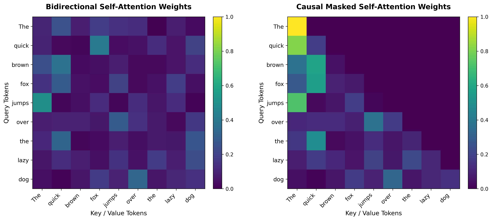

---
tags:
  - 🟢 Beginner
  - 💻 Interactive Playgrounds
  - 🔬 Math & Theory
---

# LAB-03: Attention from Scratch: PyTorch Linear Algebra

## 🎯 Learning Objectives
After completing this laboratory, you will be able to:

* Explain the mathematical operations behind **Self-Attention** and **Multi-Head Attention**.
* Implement **Scaled Dot-Product Attention** from scratch using PyTorch linear algebra operations.
* Explain the role and implementation of **Causal/Autoregressive Masking** in generative decoder architectures.
* Build a fully parameterized **Multi-Head Attention (MHA)** module and verify tensor shapes at each step.

---

## 🎓 Prerequisites
We recommend having:

* PyTorch installed in your python environment.
* Basic understanding of tensor manipulation (dimension transposition, matrix multiplication, broadcasting).
* Concept of linear projections ($W_q, W_k, W_v, W_o$).

---

## 🧠 Level 1: Intuition & Concepts

### 1. The Core Idea: Query, Key, and Value
Self-attention allows tokens in a sequence to dynamically route information based on relevance.
* **Query ($Q$):** "What information am I looking for?"
* **Key ($K$):** "What information do I contain?"
* **Value ($V$):** "What actual content do I offer if you select me?"

By computing the dot product between a query and all keys, we measure their semantic compatibility (scores). These scores are scaled, normalized via softmax to sum to 1.0 (attention weights), and then used to compute a weighted sum of the values.

### 2. Causal Masking
In generative decoder architectures (like GPT), tokens should only be allowed to attend to previous positions and themselves. To prevent looking into the "future" during training or generation, we apply a causal mask. This mask replaces future position scores with $-\infty$ before applying the softmax function, yielding exactly $0.0$ attention weight for future tokens.

---

## 💻 Level 2: Implementation

Here is our clean, PyTorch-based implementation of Scaled Dot-Product Attention:

```python
import math
import torch
import torch.nn as nn

class ScaledDotProductAttention(nn.Module):
    def forward(self, query, key, value, mask=None):
        d_k = query.size(-1)
        # Compute scores: Q K^T / sqrt(d_k)
        scores = torch.matmul(query, key.transpose(-2, -1)) / math.sqrt(d_k)

        # Apply mask
        if mask is not None:
            if mask.dtype == torch.bool:
                scores = scores.masked_fill(~mask, float("-inf"))
            else:
                scores = scores.masked_fill(mask == 0, float("-inf"))

        # Softmax to get weights
        attention_weights = torch.softmax(scores, dim=-1)

        # Output is weights * V
        output = torch.matmul(attention_weights, value)
        return output, attention_weights
```

---

## 📐 Level 3: Mathematical Foundations

??? note "📐 LAB-03: Self-Attention & Multi-Head Attention Math"
    ### Scaled Dot-Product Attention Formula
    Given matrices $Q \in \mathbb{R}^{T \times d_k}$, $K \in \mathbb{R}^{T \times d_k}$, and $V \in \mathbb{R}^{T \times d_v}$:

    $$\text{Attention}(Q, K, V) = \text{softmax}\left(\frac{Q K^T}{\sqrt{d_k}} + M\right) V$$

    Where:
    * $d_k$ is the dimensionality of key/query vectors (acts as a scaling factor to prevent gradients from vanishing for large vector dimensions).
    * $M$ is the mask matrix ($0$ for allowed connections, $-\infty$ for masked connections).

    ### Multi-Head Attention (MHA)
    Instead of performing a single attention function, Multi-Head Attention linearly projects queries, keys, and values $h$ times with different, learned projections:

    $$\text{MultiHead}(Q, K, V) = \text{Concat}(\text{head}_1, \dots, \text{head}_h) W^O$$

    $$\text{head}_i = \text{Attention}(Q W_i^Q, K W_i^K, V W_i^V)$$

    Where the projections are parameter matrices:
    * $W_i^Q \in \mathbb{R}^{d_{\text{model}} \times d_k}$
    * $W_i^K \in \mathbb{R}^{d_{\text{model}} \times d_k}$
    * $W_i^V \in \mathbb{R}^{d_{\text{model}} \times d_v}$
    * $W^O \in \mathbb{R}^{h d_v \times d_{\text{model}}}$

---

## 🔬 Level 4: Research Notes (Origin Papers)
* **Attention Is All You Need:** Vaswani et al. introduced the transformer architecture and MHA ([Vaswani et al., 2017](../../notes/01_foundations.md#ref-attention)), replacing RNNs/CNNs with pure attention blocks.

---

## 🏭 Production Insights

!!! note "🏭 Attention Execution Optimization"
    * **FlashAttention:** Computing the $N \times N$ attention matrix consumes high GPU memory ($O(N^2)$ space complexity). In production, engines like vLLM and Hugging Face utilize **FlashAttention**, which avoids materializing the massive attention matrix in HBM (High Bandwidth Memory) through tiling and online softmax.
    * **KV Caching:** During autoregressive generation, keys ($K$) and values ($V$) from previous tokens do not change. Caching these matrices avoids redundant linear projections and dot product calculations, scaling up inference throughput significantly.

---

## 🎨 Attention Visualizations

Below are the attention weight distributions comparing Bidirectional Self-Attention vs Causal Masked Attention:



--8<-- "includes/templates/a_llm_basics/playground_card_attention.md"

---

## 🧪 Try It Yourself (Experiments)
1. **Mask Verification:** Check the causal mask behavior in the playground code. Change the mask array to block out specific mid-sentence tokens (e.g. padding tokens) and verify how attention weights recalculate.
2. **Dimension divisible check:** Try initializing `MultiHeadAttention` with `d_model=16` and `n_heads=5`. Verify that it raises a `DimensionMismatchError` due to indivisibility constraints.
