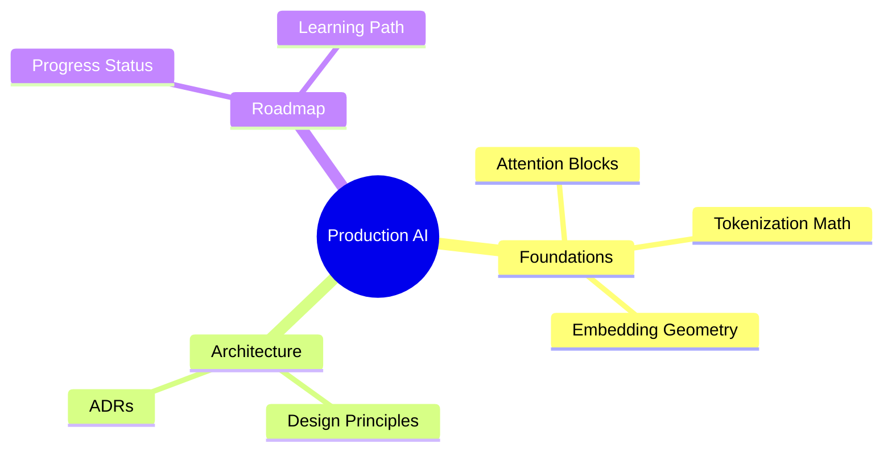

# Production AI Systems Documentation

Welcome to the official documentation for the **Production AI Systems** roadmap. This project is a comprehensive guide and repository designed for Machine Learning and AI engineers transitioning from prototyping to deploying scalable, robust, and production-grade LLM applications.

---

## 🎯 Our Philosophy

> "Frameworks change. Architecture remains."

Our goal is not to memorize high-level APIs or build generic wrappers. We focus on:
- **Systematic engineering:** Robust error handling, strict typing, and comprehensive testing.
- **Deep optimization:** Understanding tokenization math, embedding geometries, attention mechanisms, and retrieval economics.
- **Production reliability:** Minimizing hallucinations, improving grounding, and designing failover-safe agent loops.

---

## 🧭 Documentation Map

Explore the different sections of the documentation to understand the architecture and project updates:

### 🧠 [LLM Foundations](notes/01_foundations.md)
Explore our experiments, starting with **[LAB-01] Tokenization Math**, which benchmarks BPE vs WordPiece, analyzes token compression ratios, and investigates the Portuguese token tax.

### 📐 [Architecture & ADRs](architecture/overview.md)
Discover the core design principles guiding our implementations. Access our [Architecture Decision Records (ADRs)](adr/index.md) to understand why specific structures and tools were adopted.

### 🗺️ [Roadmap & Progress](roadmap.md)
Track the progression of the modules, difficulty mappings, and the status of active projects through the interactive [Progress Log](PROGRESS.md).
