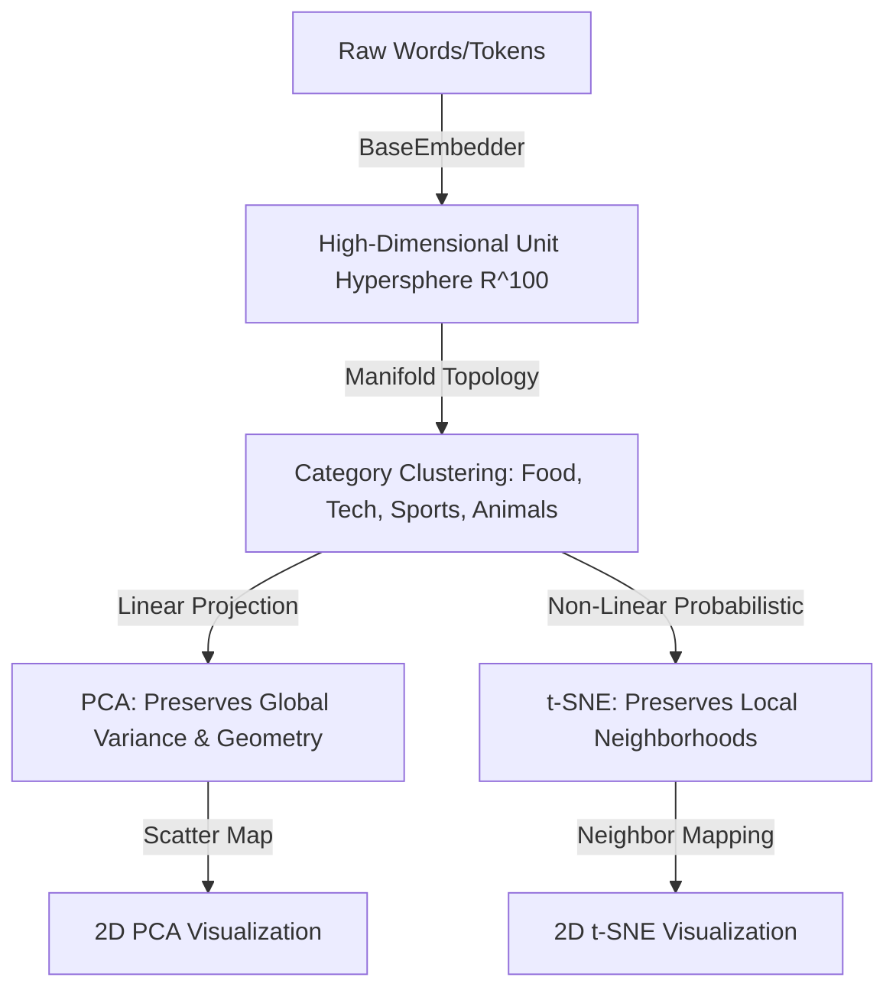

# 01 - Foundations: Large Language Models

## 🎯 Objective
Deep understanding of model internals, inference, tokenization math, embedding geometry, and self-attention mechanics.

## 📚 Concepts & Math Alignment
### 1. Tokenization as Statistical Compression
Tokenization is a fundamental data compression task. Given a corpus, we learn a vocabulary $V$ that maps variable-length sequences of characters to integer IDs. The compression efficiency is defined by:
$\text{Compression Ratio} = \frac{\text{Bytes of UTF-8 Text}}{\text{Tokens Generated}}$

- **[BPE (Byte Pair Encoding)](#ref-bpe):** Merges the most frequent adjacent byte/token pairs iteratively. Used in GPT-4 (`cl100k_base`), GPT-4o (`o200k_base`), Llama, and Claude.
- **WordPiece:** Merges the pair that maximizes the likelihood of the corpus under a unigram model, maximizing the mutual information:
  $\text{Score}(A, B) = \frac{\text{count}(A, B)}{\text{count}(A) \times \text{count}(B)}$

For a detailed walkthrough of subword tokenization algorithms, refer to the [Hugging Face Tokenizers Guide](#ref-huggingface).

---

## 📊 LAB-01: Tokenization Benchmark Results

!!! tip "Interactive Playground"
    You can run and experiment with BPE vs WordPiece algorithms, test custom texts, and check token splits interactively inside the [**tokenization_playground.ipynb**](../notebooks/a_llm_basics/tokenization_playground.ipynb) notebook.

We compared the tokenizers across various domains. Here is the empirical evaluation:

### 1. Compression Ratio (Bytes per Token)
*Higher is more efficient (fewer tokens used per byte).*

| Domain | GPT-4o (`o200k_base`) | GPT-4 (`cl100k_base`) | GPT-2 (`gpt2`) | BERT (`bert-uncased`) |
| --- | --- | --- | --- | --- |
| **Plain English** | 5.200 B/T | 5.200 B/T | 5.200 B/T | 5.200 B/T |
| **Portuguese (PT-BR)** | **5.848 B/T** | **4.825 B/T** | 3.063 B/T | 3.509 B/T |
| **Structured JSON** | 2.735 B/T | 2.735 B/T | 2.548 B/T | 2.114 B/T |
| **Numeric / Tabular** | 1.737 B/T | 1.737 B/T | 2.000 B/T | 1.886 B/T |
| **Emojis / Special Chars** | 2.077 B/T | 1.620 B/T | 1.446 B/T | 10.125 B/T* |

*\*Note: BERT's high ratio on Emojis is an artifact of replacing all unrecognized emojis with a single `[UNK]` token, representing a loss of information, whereas GPT models encode them natively without information loss.*

### 2. Token Counts (Total Tokens Generated)
*Lower token count means lower latency and API cost.*

| Domain | UTF-8 Bytes | GPT-4o (`o200k_base`) | GPT-4 (`cl100k_base`) | GPT-2 (`gpt2`) | BERT (`bert-uncased`) |
| --- | --- | --- | --- | --- | --- |
| **Plain English** | 156 B | 30 t | 30 t | 30 t | 30 t |
| **Portuguese (PT-BR)** | 193 B | **33 t** | **40 t** | 63 t | 55 t |
| **Structured JSON** | 186 B | 68 t | 68 t | 73 t | 88 t |
| **Numeric / Tabular** | 66 B | 38 t | 38 t | 33 t | 35 t |
| **Emojis / Special Chars** | 81 B | 39 t | 50 t | 56 t | 8 t |

---

## 💡 Key Architectural Insights

1. **The Portuguese Token Tax Reduction:**
   GPT-4o (`o200k_base`) uses a larger vocabulary of 200,000 tokens compared to GPT-4's 100,000. In Portuguese, this results in a **17.5% reduction in token count** (from 40 tokens to 33 tokens). For production systems processing large documents in Portuguese, migrating to GPT-4o or a model with a similar expanded vocabulary directly yields 17.5% cost savings and lower latency.

2. **JSON & Structured Tool Calling Overhead:**
   Structured JSON parsing has a compression ratio of only ~2.7 B/T compared to ~5.2 B/T for English text. Since agent workflows rely heavily on JSON schemas for Tool Calling, this structural overhead represents a significant cost driver in multi-agent routing.

3. **Digit Splitting in Finance:**
   Numeric data is tokenized at a very low compression ratio (~1.7 B/T). Tokenizers split numbers into individual or pairs of digits to allow the model to generalize math operations better, but this increases the token footprint of financial tabular data.

4. **Local Fallback Strategy:**
   For local development or API-free testing, local model routing and orchestration can be implemented using [Ollama & LiteLLM](#ref-litellm).

---

## 📐 LAB-02: Embedding Geometry & Manifold Hypothesis

!!! tip "Interactive Playground"
    You can run and experiment with these mathematical calculations, queries, and visualizations interactively inside the
    [**embeddings_playground.ipynb**](../notebooks/a_llm_basics/embeddings_playground.ipynb) notebook.

### 1. Geometric Pipeline
The flowchart below illustrates how raw semantic strings are mapped to vector spaces and subsequently projected to 2D for human analysis, preserving either local or global topological features:

#### Convergence Animation (t-SNE Morphogenesis)
Below is the animated visualization showing how high-dimensional word vectors converge onto a 2D plane using t-SNE. Points start in random high-entropy coordinates and migrate smoothly toward their respective semantic clusters:

#### 3D Space Rotation Animation (PCA 3D Representation)
Below is the 3D projection of the 100-dimensional word embeddings via PCA. The 360-degree rotation highlights the volumetric separation of the semantic clusters (Food, Tech, Sports, Animals) in the latent metric space:

### 2. The Manifold Hypothesis
The [Manifold Hypothesis](#ref-manifold) states that real-world high-dimensional data (like text embeddings in a 768 or 1536-dimensional space) lies on lower-dimensional, non-linear manifolds embedded within the high-dimensional space. By mapping discrete words or tokens into dense continuous vectors, LLMs learn smooth manifolds where:
- **Semantic proximity** translates to spatial proximity.
- **Concepts** cluster organically (e.g., technology, sports, animals, food).
- **Directions** capture relationships (e.g., the classic vector analogy: $\vec{v}_{\text{King}} - \vec{v}_{\text{Man}} + \vec{v}_{\text{Woman}} \approx \vec{v}_{\text{Queen}}$).

### 3. Dimensionality Reduction: PCA vs. t-SNE
To visualize and analyze these manifolds, we project them to 2D using:
- **[PCA (Principal Component Analysis)](#ref-pca):** A linear projection that maximizes variance along orthogonal axes. It preserves **global geometry** and large distances but can squash local cluster relationships.
- **[t-SNE (t-Distributed Stochastic Neighbor Embedding)](#ref-tsne):** A non-linear, probabilistic technique that minimizes the divergence between pairwise similarities in high-dimensional and low-dimensional spaces. It excels at preserving **local neighborhoods** and clusters, though the absolute scale and global relative positioning of clusters are not preserved.

### 4. Metric Spaces: Cosine Similarity vs. Euclidean Distance
In high-dimensional embedding spaces, we measure proximity using **[Cosine Similarity](#ref-cosine-similarity)**:
$$\text{Cosine Similarity}(u, v) = \cos(\theta) = \frac{u \cdot v}{\|u\|_2 \|v\|_2} = \frac{\sum_{i=1}^d u_i v_i}{\sqrt{\sum_{i=1}^d u_i^2} \sqrt{\sum_{i=1}^d v_i^2}}$$

- **Why Cosine Similarity?** Modern embeddings generally normalize vectors to unit length ($\|u\|_2 = 1$). Under unit normalization, Cosine Similarity is equivalent to a simple dot product, and directly maps to Euclidean distance:
  $$\|u - v\|_2^2 = \|u\|_2^2 + \|v\|_2^2 - 2(u \cdot v) = 2 - 2\cos(\theta)$$
- **Curse of Dimensionality:** In very high dimensions, Euclidean distance becomes less discriminative because the distance between almost all pairs of points converges to the same value. Cosine similarity focuses purely on the **angular difference** (direction) rather than magnitude, which captures semantic alignment more effectively.

---

## 🎮 Code Demonstration & Interactive Playgrounds

To explore, run, and experiment with the implementations of these algorithms in detail, we have consolidated all code documentation and execution patterns inside interactive Jupyter Notebooks.

Rather than reading dry static code documentation, you can run benchmarks, compute similarities, and manipulate 2D/3D charts directly:

👉 **[Launch Tokenization Benchmark Playground](../notebooks/a_llm_basics/tokenization_playground.ipynb)**

👉 **[Launch Embedding Geometry Playground](../notebooks/a_llm_basics/embeddings_playground.ipynb)**

*These playgrounds include imports and examples for BPE/WordPiece tokenizers, the custom category cluster embedder, manual cosine similarity, and dimensionality reduction projections.*

---

## 🛠️ Resources & References

Below are the academic references and technical guides used in this module, structured in a technical post-card format:

### 📄 Academic & Seminal Papers

  <!-- Attention Is All You Need -->
  <a id="ref-attention" href="https://arxiv.org/abs/1706.03762" target="_blank" class="blog-override-post">
    <h3 class="blog-post-title">Attention Is All You Need</h3>
    

      <b>Vaswani et al. · </b>
      2017-06-12
    

    

      <code>#architecture</code>
      <code>#transformers</code>
      <code>#attention</code>
      <code>#paper</code>
    

    
The seminal paper introducing the Transformer architecture, replacing recurrent and convolutional neural networks with self-attention mechanism layers.

  </a>

  <!-- BPE Paper -->
  <a id="ref-bpe" href="https://arxiv.org/abs/1508.07909" target="_blank" class="blog-override-post">
    <h3 class="blog-post-title">Neural Machine Translation of Rare Words with Subword Units</h3>
    

      <b>Sennrich et al. · </b>
      2015-08-31
    

    

      <code>#tokenization</code>
      <code>#bpe</code>
      <code>#nlp</code>
      <code>#paper</code>
    

    
The original paper adapting Byte Pair Encoding (BPE) for word segmentation in machine translation, solving the out-of-vocabulary words problem.

  </a>

  <!-- t-SNE Reference -->
  <a id="ref-tsne" href="https://www.jmlr.org/papers/volume9/vandermaaten08a/vandermaaten08a.pdf" target="_blank" class="blog-override-post">
    <h3 class="blog-post-title">Visualizing Data using t-SNE</h3>
    

      <b>Laurens van der Maaten, Geoffrey Hinton · </b>
      2008-11-01
    

    

      <code>#probabilistic-modeling</code>
      <code>#dimensionality-reduction</code>
      <code>#t-sne</code>
      <code>#paper</code>
    

    
The landmark paper introducing t-Distributed Stochastic Neighbor Embedding, showcasing its ability to preserve local neighborhood topologies compared to linear methods.

  </a>

### 📖 Technical References & Guides

  <!-- Hugging Face Guide -->
  <a id="ref-huggingface" href="https://huggingface.co/docs/tokenizers/index" target="_blank" class="blog-override-post">
    <h3 class="blog-post-title">Hugging Face Tokenizers Guide</h3>
    

      <b>Hugging Face Team · </b>
      2020-03-10
    

    

      <code>#tokenization</code>
      <code>#tooling</code>
      <code>#guide</code>
    

    
Practical implementation details, benchmarks, and algorithms for BPE, WordPiece, and SentencePiece tokenizers.

  </a>

  <!-- Ollama & LiteLLM Integration Docs -->
  <a id="ref-litellm" href="https://litellm.ai" target="_blank" class="blog-override-post">
    <h3 class="blog-post-title">Ollama & LiteLLM Integration Docs</h3>
    

      <b>LiteLLM Team · </b>
      2023-10-01
    

    

      <code>#local-inference</code>
      <code>#apis</code>
      <code>#tooling</code>
    

    
Guide on running local LLM inference engines and wrapping them with OpenAI-compatible routing for development fallbacks.

  </a>

  <!-- Manifold Hypothesis Reference -->
  <a id="ref-manifold" href="https://en.wikipedia.org/wiki/Manifold_hypothesis" target="_blank" class="blog-override-post">
    <h3 class="blog-post-title">The Manifold Hypothesis (Wikipedia)</h3>
    

      <b>Wikipedia & Community · </b>
      Mathematical Concept
    

    

      <code>#math</code>
      <code>#topology</code>
      <code>#manifold-hypothesis</code>
      <code>#reference</code>
    

    
Deep dive into why high-dimensional data distributions tend to concentrate near lower-dimensional, non-linear manifolds, which forms the mathematical foundation of neural embeddings.

  </a>

  <!-- PCA Reference -->
  <a id="ref-pca" href="https://en.wikipedia.org/wiki/Principal_component_analysis" target="_blank" class="blog-override-post">
    <h3 class="blog-post-title">Principal Component Analysis (PCA)</h3>
    

      <b>Karl Pearson · </b>
      1901-07-01
    

    

      <code>#linear-algebra</code>
      <code>#dimensionality-reduction</code>
      <code>#pca</code>
      <code>#reference</code>
    

    
Historical paper and mathematical proof detailing the process of projecting high-dimensional points onto orthogonal eigenvectors to maximize variance.

  </a>

  <!-- Cosine Similarity Reference -->
  <a id="ref-cosine-similarity" href="https://en.wikipedia.org/wiki/Cosine_similarity" target="_blank" class="blog-override-post">
    <h3 class="blog-post-title">Cosine Similarity & Vector Spaces</h3>
    

      <b>Wikipedia & Community · </b>
      Linear Algebra Metric
    

    

      <code>#linear-algebra</code>
      <code>#metric-space</code>
      <code>#cosine-similarity</code>
      <code>#reference</code>
    

    
Overview of cosine similarity, its mathematical formulation, and its application in high-dimensional information retrieval and metric vector spaces.

  </a>

