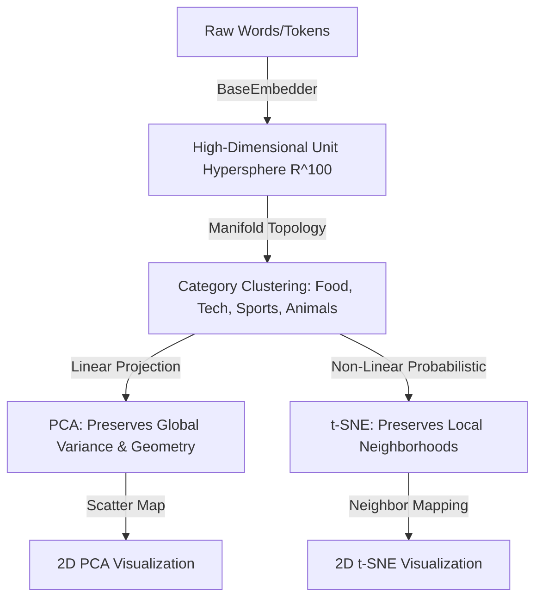

---
tags:
  - 🟢 Beginner
  - 💻 Interactive Playgrounds
  - 🔬 Math & Theory
---

# 01 - Foundations: Large Language Models

## 🎯 Learning Objectives
After reading this chapter, you will be able to:

* Explain the inner workings of subword tokenization algorithms (**BPE** and **WordPiece**).
* Compute and analyze statistical compression ratios across multiple text domains.
* Define the **Manifold Hypothesis** and its significance in semantic representation.
* Manually implement **Cosine Similarity** and explain why Euclidean distance fails in high-dimensional spaces.
* Apply linear (**PCA**) and non-linear (**t-SNE**) dimensionality reduction to project and visualize embeddings in 2D/3D.

---

## 🎓 Prerequisites
To get the most out of this chapter, we recommend:

* **Basic Linear Algebra:** Vectors, vector norms, dot product, and eigenvectors.
* **Basic Probability:** Probability distributions, Kullback-Leibler (KL) divergence, and variance.
* **Python Programming:** Familiarity with Python OOP and basic array manipulation using `NumPy`.

---

## 🧠 Level 1: Intuition & Concepts

### 1. Tokenization as Statistical Compression
LLMs do not process raw text directly. Instead, they rely on a **Tokenizer** to split input text into smaller units called **Tokens**, mapping them to integer IDs within a fixed vocabulary.
We can frame tokenization as a statistical data compression task: the goal is to encode the highest amount of textual information using the fewest tokens possible, maximizing the efficiency of the model's limited context window.

### 2. The Manifold Hypothesis
The **Manifold Hypothesis** states that real-world high-dimensional data (such as text representations in a 768 or 1536-dimensional space) does not spread out uniformly. Instead, it concentrates near lower-dimensional, non-linear sub-spaces (manifolds).
By mapping words to dense continuous vectors, LLMs learn a smooth manifold where:
* **Semantic proximity** translates to spatial proximity (similar words cluster together).
* **Directions** capture conceptual relationships (e.g., $\vec{v}_{\text{King}} - \vec{v}_{\text{Man}} + \vec{v}_{\text{Woman}} \approx \vec{v}_{\text{Queen}}$).

### 3. Dimensionality Reduction: PCA vs. t-SNE
To visualize and analyze these manifolds, we project them to 2D/3D space using:
* **PCA (Principal Component Analysis):** A linear projection that maximizes variance along orthogonal axes. It preserves the **global geometry** and large distances, but can squish local neighbor relationships.
* **t-SNE (t-Distributed Stochastic Neighbor Embedding):** A non-linear, probabilistic technique that minimizes divergence between pairwise similarities. It excels at preserving **local neighborhoods** and clusters, though the absolute scale and global positions are not preserved.

### 4. Metric Spaces: Cosine Similarity vs. Euclidean Distance
In high-dimensional embedding spaces, we measure similarity using the angle between vectors rather than their straight-line distance.
* **Why Cosine Similarity?** Modern embeddings generally normalize vectors to unit length ($\|u\|_2 = 1$). Under unit normalization, Cosine Similarity is equivalent to a simple dot product, and directly maps to Euclidean distance:
  $$\|u - v\|_2^2 = \|u\|_2^2 + \|v\|_2^2 - 2(u \cdot v) = 2 - 2\cos(\theta)$$
* **Curse of Dimensionality:** In very high dimensions, Euclidean distance becomes less discriminative because the distance between almost all pairs of points converges to the same value. Cosine similarity focuses purely on the **angular difference** (direction) rather than magnitude, which captures semantic alignment more effectively.

---

## 💻 Level 2: Implementation

Here is how we model these concepts in clean, SOLID code:

### 1. Tokenizer Interfaces & Wrapper Class
We define a decoupled abstraction for tokenizers to easily switch backend providers:

```python
from abc import ABC, abstractmethod

class BaseTokenizer(ABC):
    @abstractmethod
    def encode(self, text: str) -> list[int]:
        """Converts raw text into a list of token IDs."""
        pass

    @abstractmethod
    def decode(self, ids: list[int]) -> str:
        """Converts a list of token IDs back into raw text."""
        pass
```

### 2. Manual Cosine Similarity implementation
We compute cosine similarity manually using NumPy, ensuring safe division checks:

```python
import numpy as np

def cosine_similarity(u: np.ndarray, v: np.ndarray) -> float:
    """Computes the cosine similarity between two 1D arrays."""
    norm_u = np.linalg.norm(u)
    norm_v = np.linalg.norm(v)
    if norm_u == 0.0 or norm_v == 0.0:
        return 0.0
    return float(np.dot(u, v) / (norm_u * norm_v))
```

---

## 📐 Level 3: Mathematical Foundations

For a deep understanding of these algorithms, we explore their mathematical formulations.

??? note "📐 LAB-01: Tokenizer Algorithms Math"
    ### Byte Pair Encoding (BPE)
    BPE initializes the vocabulary with all individual characters (single bytes) and iteratively merges the most frequent adjacent pair of tokens found in the training corpus:

    $$\text{Merged Pair} = \arg\max_{A, B \in V} \text{Count}(A, B)$$

    ### WordPiece
    WordPiece merges the pair of tokens that maximizes the likelihood of the training data under a unigram language model. This corresponds to maximizing the mutual information score:

    $$\text{Score}(A, B) = \frac{\text{count}(A, B)}{\text{count}(A) \times \text{count}(B)}$$

    If $A$ and $B$ almost always appear together and rarely apart, their score is high, leading to a merge.

??? note "📐 LAB-02: Geometric Metric Spaces & Reductions Math"
    ### Cosine Similarity Formula
    The similarity measures the cosine of the angle $\theta$ between two non-zero vectors $u$ and $v$:

    $$\text{Cosine Similarity}(u, v) = \cos(\theta) = \frac{u \cdot v}{\|u\|_2 \|v\|_2} = \frac{\sum_{i=1}^d u_i v_i}{\sqrt{\sum_{i=1}^d u_i^2} \sqrt{\sum_{i=1}^d v_i^2}}$$

    ### PCA (Principal Component Analysis)
    PCA projects high-dimensional data onto orthogonal axes that maximize variance. This is done by computing the eigenvectors and eigenvalues of the covariance matrix of the data $\mathbf{X}$:

    $$\mathbf{\Sigma} = \frac{1}{n-1} \mathbf{X}^T \mathbf{X}$$

    $$\mathbf{\Sigma} v_i = \lambda_i v_i$$

    The eigenvectors $v_i$ with the largest eigenvalues $\lambda_i$ define the principal axes of projection.

    ### t-SNE (t-Distributed Stochastic Neighbor Embedding)
    t-SNE maps high-dimensional points to a low-dimensional manifold:
    1. In high-dimensional space, we define the probability distribution $p_{j|i}$ that point $x_i$ picks $x_j$ as its neighbor under a Gaussian:
       $$p_{j|i} = \frac{\exp(-\|x_i - x_j\|^2 / 2\sigma_i^2)}{\sum_{k \neq i} \exp(-\|x_i - x_k\|^2 / 2\sigma_i^2)}$$

    2. In low-dimensional space, we define the probability distribution $q_{ij}$ using a heavy-tailed Student-t distribution (1 degree of freedom) to avoid the "crowding problem":
       $$q_{ij} = \frac{(1 + \|y_i - y_j\|^2)^{-1}}{\sum_{k} \sum_{l \neq k} (1 + \|y_k - y_l\|^2)^{-1}}$$

    3. We minimize the Kullback-Leibler (KL) divergence between $P$ and $Q$ using gradient descent:
       $$KL(P || Q) = \sum_{i} \sum_{j \neq i} p_{ij} \log \frac{p_{ij}}{q_{ij}}$$

---

## 🔬 Level 4: Research Notes (Origin Papers)

These laboratories are directly inspired by these seminal papers:

* **Byte Pair Encoding:** adapt subword units for machine translation, resolving the out-of-vocabulary (OOV) problem ([Sennrich et al., 2015](#ref-bpe)).
* **t-SNE Visualization:** Laurens van der Maaten and Geoffrey Hinton introduced the t-SNE algorithm ([Van der Maaten & Hinton, 2008](#ref-tsne)), showing how Student-t distributions preserve local topologies.
* **The Transformer:** Vaswani et al. introduced self-attention mechanism layers ([Vaswani et al., 2017](#ref-attention)).

---

## 🏭 Production Insights

!!! note "🏭 Token Tax & Localization"
    * **The Portuguese Token Tax:** Older vocabularies split non-English letters (like `ç`, `ã`) into multiple byte tokens. The transition from GPT-4 (`cl100k_base`) to GPT-4o (`o200k_base`) expanded the vocabulary, resulting in a **17.5% reduction in token count** for Portuguese texts. This translates directly to lower latency and API costs.
    * **JSON Schema Overhead:** Structured data serialization for tool calling degrades the compression ratio to ~2.7 B/T. Keep JSON schemas minimal to optimize the context window footprint.

!!! note "🏭 Embeddings & Database Optimization"
    * **Offline vs Online Embeddings:** Calling embedding APIs in real-time adds 100ms-300ms of latency. Static documents (catalogues, PDFs) should have their embeddings computed *offline* in batches and cached in a Vector Database.
    * **Normalizing Vectors:** Always normalize your vectors to unit length ($\|u\|_2 = 1$) on ingestion. This allows fast dot product calculation instead of heavy cosine similarity equations during similarity search queries.

---

## 📊 LAB-01: Tokenization Benchmark Results

We compared the tokenizers across various domains. Here is the empirical evaluation:

### 1. Compression Ratio (Bytes per Token)
*Higher is more efficient (fewer tokens used per byte).*

| Domain | GPT-4o (`o200k_base`) | GPT-4 (`cl100k_base`) | GPT-2 (`gpt2`) | BERT (`bert-uncased`) |
| --- | --- | --- | --- | --- |
| **Plain English** | 5.200 B/T | 5.200 B/T | 5.200 B/T | 5.200 B/T |
| **Portuguese (PT-BR)** | **5.848 B/T** | **4.825 B/T** | 3.063 B/T | 3.509 B/T |
| **Structured JSON** | 2.735 B/T | 2.735 B/T | 2.548 B/T | 2.114 B/T |
| **Numeric / Tabular** | 1.737 B/T | 1.737 B/T | 2.000 B/T | 1.886 B/T |
| **Emojis / Special Chars** | 2.077 B/T | 1.620 B/T | 1.446 B/T | 10.125 B/T* |

*\*Note: BERT's high ratio on Emojis is an artifact of replacing all unrecognized emojis with a single `[UNK]` token, representing a loss of information, whereas GPT models encode them natively.*

### 2. Token Counts (Total Tokens Generated)
*Lower token count means lower latency and API cost.*

| Domain | UTF-8 Bytes | GPT-4o (`o200k_base`) | GPT-4 (`cl100k_base`) | GPT-2 (`gpt2`) | BERT (`bert-uncased`) |
| --- | --- | --- | --- | --- | --- |
| **Plain English** | 156 B | 30 t | 30 t | 30 t | 30 t |
| **Portuguese (PT-BR)** | 193 B | **33 t** | **40 t** | 63 t | 55 t |
| **Structured JSON** | 186 B | 68 t | 68 t | 73 t | 88 t |
| **Numeric / Tabular** | 66 B | 38 t | 38 t | 33 t | 35 t |
| **Emojis / Special Chars** | 81 B | 39 t | 50 t | 56 t | 8 t |

---

## 📐 LAB-02: Embedding Geometry & Manifold Hypothesis

We map semantic strings to high-dimensional spaces and project them using PCA and t-SNE.

### 1. Geometric Pipeline
The flowchart below illustrates how raw semantic strings are mapped to vector spaces and subsequently projected to 2D:



### 2. Convergence Animation (t-SNE Morphogenesis)
t-SNE converges onto a 2D plane. Points start in random high-entropy coordinates and migrate smoothly toward their respective semantic clusters:


### 3. 3D Space Rotation Animation (PCA 3D Representation)
A 3D projection of the 100-dimensional word embeddings via PCA. The 360-degree rotation highlights the volumetric separation of the clusters:


### 4. Empirical Evaluation Metrics
We measure the cosine similarity on our dataset to evaluate clustering quality:

* **Average Similarity within same category (Intra):** `0.5945`
* **Average Similarity across different categories (Inter):** `-0.0131`
* **Discriminative Margin:** **`0.6077`** (validates clean category clustering).

---

--8<-- "includes/templates/playground_card_foundations.md"

---

## 🧪 Try It Yourself (Experiments)

Explore these exercises in the Jupyter Playgrounds:

1. **t-SNE Perplexity Shift:**
   In the embedding playground, change the `perplexity` parameter from `5` to `30`. Note how the local neighborhood structure breaks when the perplexity exceeds the number of sample points.
2. **Out-of-Vocabulary Analysis:**
   Input blended-category queries (like *"sports car"* or *"fruit juice"*) to the `SemanticSearchEngine` and analyze which cluster center pulls the query vector closest.

---

## 🧭 Related Concepts

These topics lay the foundation for subsequent modules:

* **Vector Databases & ANN Indexes:** Scalable vector index structures (HNSW, IVF-Flat).
* **Attention Mechanism (Self-Attention):** Dynamic token similarity computing using dot products.
* **Semantic Chunking:** Text split strategies based on embedding variance.

---

## 🏁 Key Takeaways
* **Tokenization is Compression:** Vocabulary models optimize text encoding efficiency to manage context limitations.
* **Cosine Similarity Preference:** Angular measurement is preferred over Euclidean distance to counter the curse of high dimensions.
* **PCA vs t-SNE Trade-offs:** PCA retains global geometric structure; t-SNE focuses purely on local neighbor groupings.

---

## 🛠️ Resources & References

Below are the academic references and technical guides used in this module, structured in a technical post-card format:


### 📄 Academic & Seminal Papers

<div class="blog-override-posts">

  <!-- Attention Is All You Need -->
  <a id="ref-attention" href="https://arxiv.org/abs/1706.03762" target="_blank" class="blog-override-post">
    <h3 class="blog-post-title">Attention Is All You Need</h3>
    <div class="blog-post-extra">
      <b>Vaswani et al. · </b>
      <span>2017-06-12</span>
    </div>
    <div class="blogging-tags-grid">
      <code>#architecture</code>
      <code>#transformers</code>
      <code>#attention</code>
      <code>#paper</code>
    </div>
    <p class="blog-post-description">The seminal paper introducing the Transformer architecture, replacing recurrent and convolutional neural networks with self-attention mechanism layers.</p>
  </a>

  <!-- BPE Paper -->
  <a id="ref-bpe" href="https://arxiv.org/abs/1508.07909" target="_blank" class="blog-override-post">
    <h3 class="blog-post-title">Neural Machine Translation of Rare Words with Subword Units</h3>
    <div class="blog-post-extra">
      <b>Sennrich et al. · </b>
      <span>2015-08-31</span>
    </div>
    <div class="blogging-tags-grid">
      <code>#tokenization</code>
      <code>#bpe</code>
      <code>#nlp</code>
      <code>#paper</code>
    </div>
    <p class="blog-post-description">The original paper adapting Byte Pair Encoding (BPE) for word segmentation in machine translation, solving the out-of-vocabulary words problem.</p>
  </a>

  <!-- t-SNE Reference -->
  <a id="ref-tsne" href="https://www.jmlr.org/papers/volume9/vandermaaten08a/vandermaaten08a.pdf" target="_blank" class="blog-override-post">
    <h3 class="blog-post-title">Visualizing Data using t-SNE</h3>
    <div class="blog-post-extra">
      <b>Laurens van der Maaten, Geoffrey Hinton · </b>
      <span>2008-11-01</span>
    </div>
    <div class="blogging-tags-grid">
      <code>#probabilistic-modeling</code>
      <code>#dimensionality-reduction</code>
      <code>#t-sne</code>
      <code>#paper</code>
    </div>
    <p class="blog-post-description">The landmark paper introducing t-Distributed Stochastic Neighbor Embedding, showcasing its ability to preserve local neighborhood topologies compared to linear methods.</p>
  </a>

</div>

### 📖 Technical References & Guides

<div class="blog-override-posts">

  <!-- Hugging Face Guide -->
  <a id="ref-huggingface" href="https://huggingface.co/docs/tokenizers/index" target="_blank" class="blog-override-post">
    <h3 class="blog-post-title">Hugging Face Tokenizers Guide</h3>
    <div class="blog-post-extra">
      <b>Hugging Face Team · </b>
      <span>2020-03-10</span>
    </div>
    <div class="blogging-tags-grid">
      <code>#tokenization</code>
      <code>#tooling</code>
      <code>#guide</code>
    </div>
    <p class="blog-post-description">Practical implementation details, benchmarks, and algorithms for BPE, WordPiece, and SentencePiece tokenizers.</p>
  </a>

  <!-- Ollama & LiteLLM Integration Docs -->
  <a id="ref-litellm" href="https://litellm.ai" target="_blank" class="blog-override-post">
    <h3 class="blog-post-title">Ollama & LiteLLM Integration Docs</h3>
    <div class="blog-post-extra">
      <b>LiteLLM Team · </b>
      <span>2023-10-01</span>
    </div>
    <div class="blogging-tags-grid">
      <code>#local-inference</code>
      <code>#apis</code>
      <code>#tooling</code>
    </div>
    <p class="blog-post-description">Guide on running local LLM inference engines and wrapping them with OpenAI-compatible routing for development fallbacks.</p>
  </a>

  <!-- Manifold Hypothesis Reference -->
  <a id="ref-manifold" href="https://en.wikipedia.org/wiki/Manifold_hypothesis" target="_blank" class="blog-override-post">
    <h3 class="blog-post-title">The Manifold Hypothesis (Wikipedia)</h3>
    <div class="blog-post-extra">
      <b>Wikipedia & Community · </b>
      <span>Mathematical Concept</span>
    </div>
    <div class="blogging-tags-grid">
      <code>#math</code>
      <code>#topology</code>
      <code>#manifold-hypothesis</code>
      <code>#reference</code>
    </div>
    <p class="blog-post-description">Deep dive into why high-dimensional data distributions tend to concentrate near lower-dimensional, non-linear manifolds, which forms the mathematical foundation of neural embeddings.</p>
  </a>

  <!-- PCA Reference -->
  <a id="ref-pca" href="https://en.wikipedia.org/wiki/Principal_component_analysis" target="_blank" class="blog-override-post">
    <h3 class="blog-post-title">Principal Component Analysis (PCA)</h3>
    <div class="blog-post-extra">
      <b>Karl Pearson · </b>
      <span>1901-07-01</span>
    </div>
    <div class="blogging-tags-grid">
      <code>#linear-algebra</code>
      <code>#dimensionality-reduction</code>
      <code>#pca</code>
      <code>#reference</code>
    </div>
    <p class="blog-post-description">Historical paper and mathematical proof detailing the process of projecting high-dimensional points onto orthogonal eigenvectors to maximize variance.</p>
  </a>

  <!-- Cosine Similarity Reference -->
  <a id="ref-cosine-similarity" href="https://en.wikipedia.org/wiki/Cosine_similarity" target="_blank" class="blog-override-post">
    <h3 class="blog-post-title">Cosine Similarity & Vector Spaces</h3>
    <div class="blog-post-extra">
      <b>Wikipedia & Community · </b>
      <span>Linear Algebra Metric</span>
    </div>
    <div class="blogging-tags-grid">
      <code>#linear-algebra</code>
      <code>#metric-space</code>
      <code>#cosine-similarity</code>
      <code>#reference</code>
    </div>
    <p class="blog-post-description">Overview of cosine similarity, its mathematical formulation, and its application in high-dimensional information retrieval and metric vector spaces.</p>
  </a>

</div>
