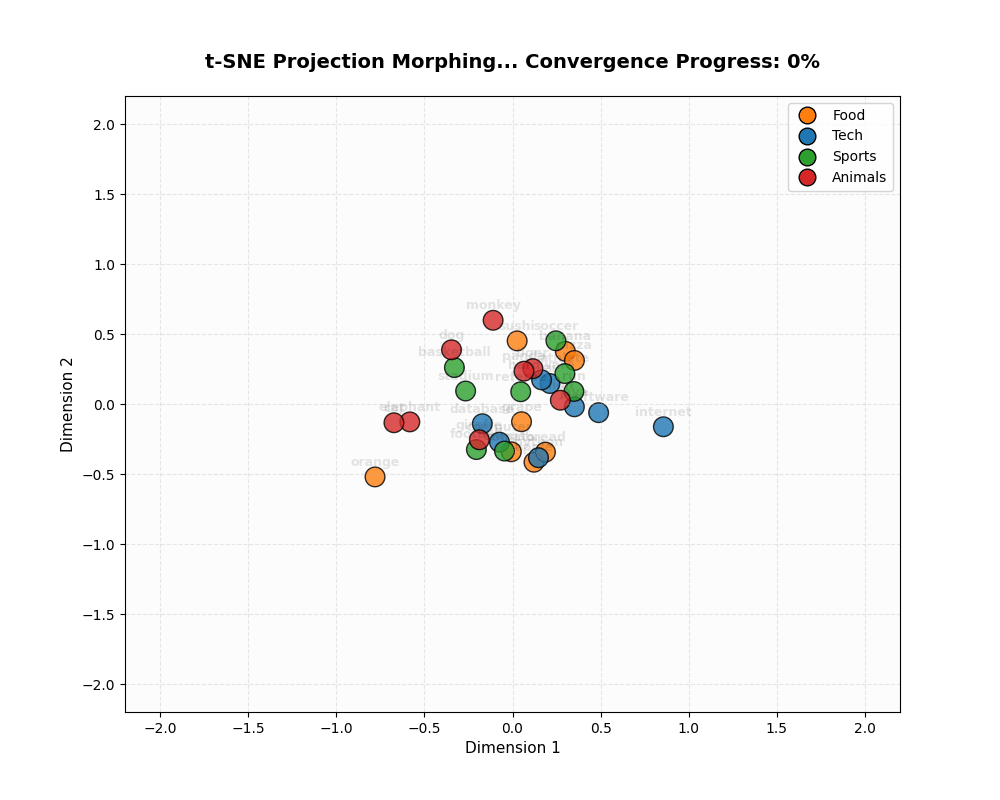
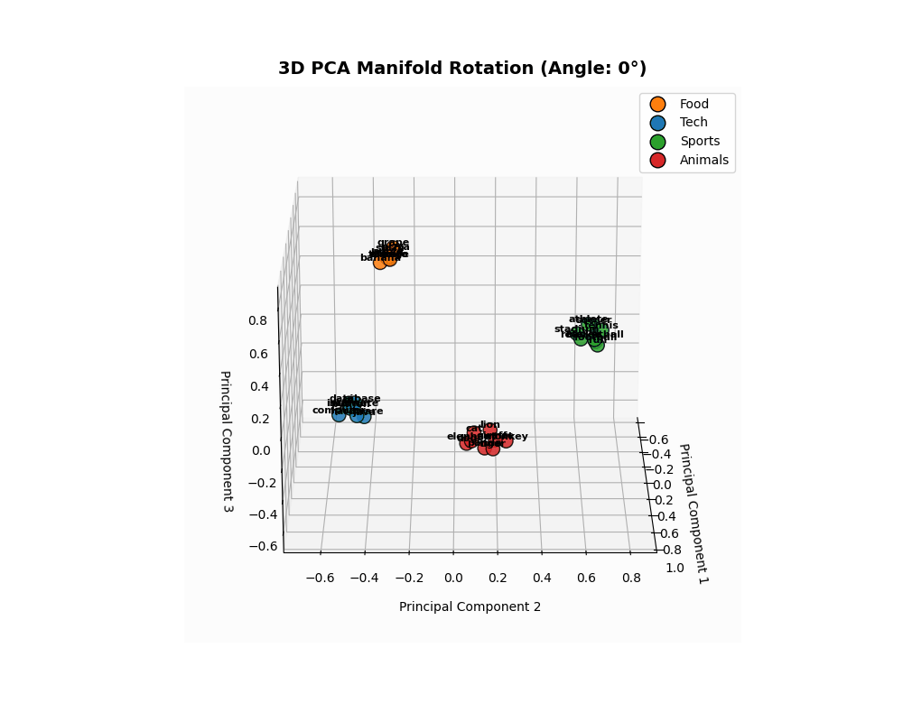

---
tags:
  - 🟢 Beginner
  - 💻 Interactive Playgrounds
  - 🔬 Math & Theory
---

# LAB-02: Embedding Geometry & Semantic Search

## 🎯 Learning Objectives
After completing this laboratory, you will be able to:

* Explain the **Manifold Hypothesis** and its role in continuous word representation.
* Manually compute **Cosine Similarity** using NumPy and explain why it is preferred over Euclidean distance.
* Perform dimensionality reduction in 2D and 3D using linear (**PCA**) and non-linear (**t-SNE**) algorithms.
* Build a local **Semantic Search Engine** to index and retrieve text documents by semantic proximity.

---

## 🎓 Prerequisites
We recommend having:

* Linear Algebra basics (vectors, dot product, norms).
* Basic statistics (probability distributions, variance).
* Scikit-Learn and Matplotlib installed in your environment.

---

## 🧠 Level 1: Intuition & Concepts

### 1. The Manifold Hypothesis
High-dimensional datasets (like text embeddings in a 100D or 1536D space) lie on lower-dimensional, non-linear manifolds embedded within the high-dimensional space. By mapping tokens into dense vectors, LLMs learn a smooth manifold where:

* Semantic proximity maps to spatial proximity.
* Directions capture conceptual relationships (e.g., King - Man + Woman = Queen).

### 2. PCA vs. t-SNE Projections
* **PCA (Principal Component Analysis):** A linear projection that maximizes variance along orthogonal axes. It preserves the **global geometry** and large distances, but can squish local neighbor structures.
* **t-SNE (t-Distributed Stochastic Neighbor Embedding):** A non-linear, probabilistic technique that minimizes divergence between pairwise similarities. It excels at preserving **local neighborhoods** and clusters.

### 3. Metric Spaces: Cosine vs. Euclidean Proximity
In very high dimensions, Euclidean distance becomes less discriminative because the distance between almost all pairs of points converges to the same value (the *curse of dimensionality*). Cosine similarity focuses purely on the **angular difference** (direction) rather than magnitude, which captures semantic alignment more effectively.

---

## 💻 Level 2: Implementation

Here is our clean, manual implementation of Cosine Similarity and semantic retrieval:

```python
import numpy as np

def cosine_similarity(u: np.ndarray, v: np.ndarray) -> float:
    """Computes the cosine similarity between two 1D arrays."""
    norm_u = np.linalg.norm(u)
    norm_v = np.linalg.norm(v)
    if norm_u == 0.0 or norm_v == 0.0:
        return 0.0
    return float(np.dot(u, v) / (norm_u * norm_v))
```

This math is integrated inside our `SemanticSearchEngine`, which indexes unit-normalized vectors and queries them using matrix multiplications for high efficiency.

---

## 📐 Level 3: Mathematical Foundations

??? note "📐 LAB-02: Geometrical Reductions & Metric Spaces Math"
    ### Cosine Similarity Formula
    The similarity measures the cosine of the angle $\theta$ between two non-zero vectors $u$ and $v$:

    $$\text{Cosine Similarity}(u, v) = \cos(\theta) = \frac{u \cdot v}{\|u\|_2 \|v\|_2} = \frac{\sum_{i=1}^d u_i v_i}{\sqrt{\sum_{i=1}^d u_i^2} \sqrt{\sum_{i=1}^d v_i^2}}$$

    ### PCA (Principal Component Analysis)
    PCA projects high-dimensional data onto orthogonal axes that maximize variance. This is done by computing the eigenvectors and eigenvalues of the covariance matrix of the data $\mathbf{X}$:

    $$\mathbf{\Sigma} = \frac{1}{n-1} \mathbf{X}^T \mathbf{X}$$

    $$\mathbf{\Sigma} v_i = \lambda_i v_i$$

    The eigenvectors $v_i$ with the largest eigenvalues $\lambda_i$ define the principal axes of projection.

    ### t-SNE Pairwise Similarities
    In high-dimensional space, we define the probability distribution $p_{j|i}$ that point $x_i$ picks $x_j$ as its neighbor under a Gaussian:

    $$p_{j|i} = \frac{\exp(-\|x_i - x_j\|^2 / 2\sigma_i^2)}{\sum_{k \neq i} \exp(-\|x_i - x_k\|^2 / 2\sigma_i^2)}$$

    In low-dimensional space, we define the probability distribution $q_{ij}$ using a heavy-tailed Student-t distribution (1 degree of freedom) to avoid the "crowding problem":

    $$q_{ij} = \frac{(1 + \|y_i - y_j\|^2)^{-1}}{\sum_{k} \sum_{l \neq k} (1 + \|y_k - y_l\|^2)^{-1}}$$

    We minimize the Kullback-Leibler (KL) divergence between $P$ and $Q$ using gradient descent:

    $$KL(P || Q) = \sum_{i} \sum_{j \neq i} p_{ij} \log \frac{p_{ij}}{q_{ij}}$$

---

## 🔬 Level 4: Research Notes (Origin Papers)
* **t-SNE Visualization:** Laurens van der Maaten and Geoffrey Hinton introduced the t-SNE algorithm ([Van der Maaten & Hinton, 2008](../../notes/01_foundations.md#ref-tsne)), showing how Student-t distributions preserve local topologies.
* **The Manifold Hypothesis:** For a mathematical deep dive into data manifolds, consult the wiki reference ([Manifold Hypothesis](../../notes/01_foundations.md#ref-manifold)).

---

## 🏭 Production Insights

!!! note "🏭 Embeddings & Database Optimization"
    * **Offline vs Online Embeddings:** Calling embedding APIs in real-time adds 100ms-300ms of latency. Static documents (catalogues, PDFs) should have their embeddings computed *offline* in batches and cached in a Vector Database.
    * **Normalizing Vectors:** Always normalize your vectors to unit length ($\|u\|_2 = 1$) on ingestion. This allows fast dot product calculation instead of heavy cosine similarity equations during similarity search queries.

---

## 📊 LAB-02: Empirical Results

Our category-based embedding space (100D) yielded these semantic metric distances:

| Metric Semantics | Value | Purpose |
| --- | ---: | --- |
| **Average Similarity (Intra-Class)** | `0.5945` | Measures cluster affinity (same category words). |
| **Average Similarity (Inter-Class)** | `-0.0131` | Measures orthogonality between distinct categories. |
| **Discriminative Margin** | **`0.6077`** | Verifies clean category separation on the manifold. |

---

## 🎨 Visualizations of the Manifold

### 1. t-SNE Morphogenesis (2D Convergence)
Points starting in random coordinates converge onto a 2D plane:



### 2. 3D PCA Latent Space Rotation
A 3D projection highlights the volumetric separation of the semantic clusters:



---

--8<-- "includes/templates/a_llm_basics/playground_card_embeddings.md"

---

## 🧪 Try It Yourself (Experiments)
1. **t-SNE Perplexity Shift:** In the playground notebook, change the `perplexity` parameter from `5` to `30`. Note how the local neighborhood structure breaks when the perplexity exceeds the number of sample points.
2. **Out-of-Vocabulary Analysis:** Input blended-category queries (like *"sports car"*) to the search engine and analyze which category cluster pulls the vector closest.

---

## 🧭 Related Concepts
* **Vector Databases & HNSW Indexing:** Scalable production retrieval setups for embeddings.
* **Self-Attention Mechanics:** Using dot products dynamically to calculate contextual similarity between tokens.
