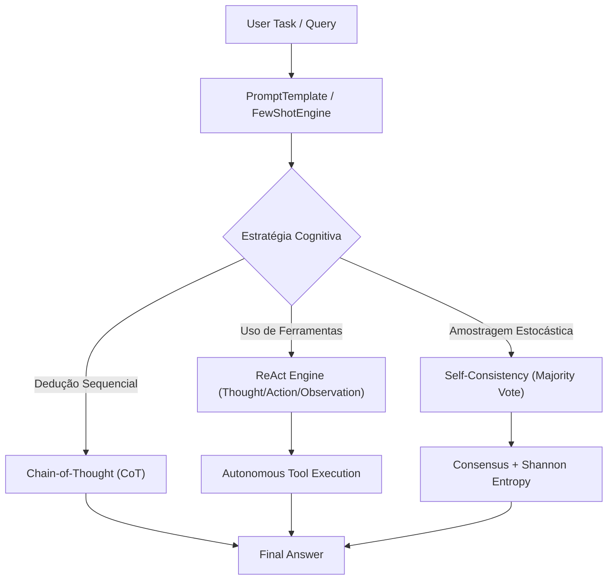

# 🧠 LAB-05: Prompt Reasoning Patterns

Bem-vindo ao **LAB-05**, o primeiro laboratório do módulo de **Prompt Engineering & Structured Outputs**.

Este laboratório aborda a evolução conceitual e empírica das estratégias de indução cognitiva em Modelos de Linguagem de Grande Porte (LLMs): desde a formulação de templates estritos até a execução de loops autônomos de raciocínio e ação (**ReAct**).

---

## 🎯 Arquitetura & Implementação (OOP sob SOLID)

O módulo foi implementado em [`projects/b_prompt_engineering/src/lab_05_reasoning/`](https://github.com/RogerioLS/production-ai-systems/tree/main/projects/b_prompt_engineering/src/lab_05_reasoning/) respeitando tipagem estrita (PEP 484), validação com Pydantic v2 e logging estruturado com `loguru`.

---

## 🔬 Componentes Centrais

### 1. `PromptTemplate` & `ChatPromptTemplate`
- Validação estática de variáveis obrigatórias antes da interpolação.
- Previne vazamentos acidentais de placeholders como `{variable}` em payloads de APIs em produção.

### 2. `FewShotPromptEngine` (In-Context Learning)
- Gestão centralizada de demonstradores (*Exemplars*).
- Suporte a seleção k-limitada e seletores dinâmicos via callbacks (e.g. similaridade semântica ou domínio).

### 3. `ChainOfThoughtPromptEngine`
- Indução de passos intermediários com *zero-shot triggers* (*"Let's think step by step"*).
- Extrator determinístico de resposta final a partir de traces de raciocínio prolixos.

### 4. `SelfConsistencyEngine`
- Amostragem estocástica com votação por maioria (*Majority Voting*).
- Cálculo da **Entropia de Shannon** da distribuição de respostas para quantificar a dispersão/incerteza do modelo:
  $$H(X) = -\sum_{i=1}^{n} P(x_i) \log_2 P(x_i)$$

### 5. `ReActEngine`
- Implementação industrial do ciclo:
  $$\text{Thought} \rightarrow \text{Action} \rightarrow \text{Observation} \rightarrow \text{Final Answer}$$
- Registro estruturado de cada passo (`ReActStep`) com medição de latência total e proteção contra loops infinitos via `max_iterations`.

---

## 📊 Métricas e Resultados Empíricos

| Padrão | Capacidade Chave | Trade-off Principal |
| :--- | :--- | :--- |
| **Zero-Shot** | Baixa latência e menor consumo de tokens | Vulnerável a alucinações em problemas multistep |
| **Few-Shot (ICL)** | Condicionamento semântico determinístico | Aumenta o footprint da janela de contexto |
| **Chain-of-Thought** | Desdobra premissas lógicas passo a passo | Maior latência na geração de tokens |
| **Self-Consistency** | Alta precisão via consenso estatístico | Custo multiplicado pelo fator $N$ de amostras |
| **ReAct** | Resolução autônoma via ambiente/ferramentas | Risco de loop e latência dependente de I/O externo |

---

## ✅ Critérios de Aceite Atendidos
- [x] Arquitetura modular sob SOLID em `projects/b_prompt_engineering/src/lab_05_reasoning/`.
- [x] 18 novos testes unitários dedicados em `projects/b_prompt_engineering/tests/test_reasoning.py`.
- [x] 61/61 testes unitários passando globalmente com 100% de sucesso.
- [x] Linters (Black, Isort, Ruff, Detect-Secrets) 100% aprovados.
