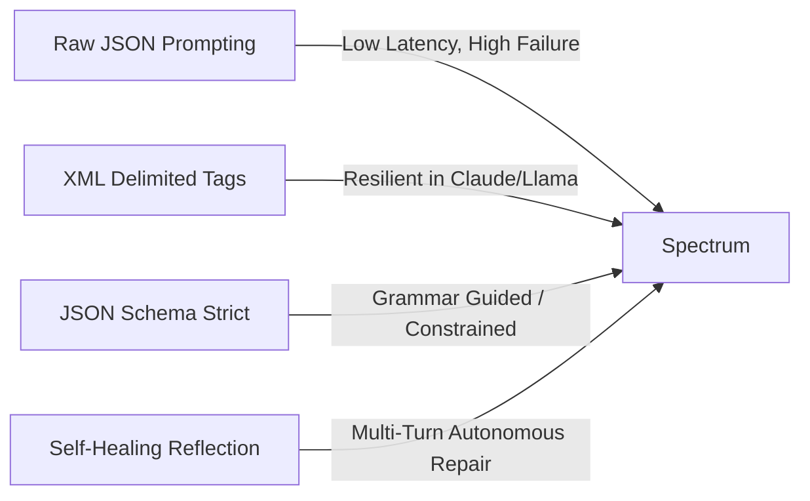
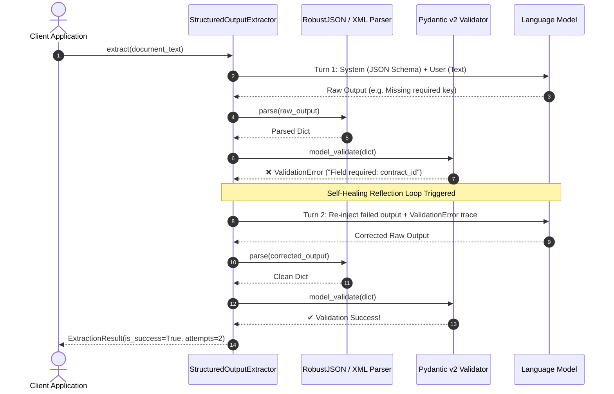

---
tags:
  - 🟡 Intermediate
  - 💻 Interactive Playgrounds
  - 🔬 Math & Theory
---

# LAB-06: Structured Outputs: Pydantic v2, Instructor & Schema Enforcement

## 🎯 Learning Objectives
After completing this laboratory, you will be able to:

* Architect production-grade **Pydantic v2 domain schemas** with nested types, `@field_validator`, and cross-field invariant `@model_validator`.
* Implement **resilient parsing heuristics** capable of stripping conversational preambles, markdown code fences, and repairing trailing commas.
* Configure alternative output modalities, including **XML Tag Delimited Prompting** for models with high tag affinity.
* Construct an autonomous **Self-Healing / Reflection error recovery loop** that re-injects validation tracebacks into follow-up LLM turns for deterministic error repair.
* Interface with **Instructor & OpenAI Tool Calling** for native schema enforcement.
* Benchmark and evaluate extraction reliability, syntax error rates, and latency overhead across strategies.

---

## 🎓 Prerequisites
We recommend having:

* Python 3.10+ with strict type annotations and Pydantic v2 (`pip install pydantic>=2.0`).
* Understanding of JSON Schema specifications and Prompt Engineering principles.
* Familiarity with OOP principles (SOLID, Exception Handling, Interfaces).

---

## 🧠 Level 1: Intuition & Concepts

### 1. The Challenge of Unstructured Outputs in Enterprise AI
Large Language Models are probabilistic next-token predictors. When asked to generate machine-readable data (JSON, XML, YAML) without structural constraints, models suffer from:
* **Conversational Preambles:** Emitting phrases like *"Sure, here is your JSON:"* before the payload.
* **Syntax Breakages:** Unescaped quotation marks, markdown code fences (` ```json `), and trailing commas (`{"a": 1,}`).
* **Schema Hallucinations:** Missing required keys, hallucinated extra fields, or unexpected data types (e.g. string dates instead of ISO format, strings instead of floats).

In production AI systems, downstream systems (SQL databases, financial ledgers, transactional APIs) require **deterministic 100% schema compliance**.

### 2. Pydantic v2 Runtime Validation
Pydantic v2 compiled with `pydantic-core` (Rust backend) provides ultra-fast runtime data validation. By modeling extraction schemas with `BaseModel`, `Field(..., description=...)`, and custom validators, we establish a strict contract that guarantees any instantiated object is guaranteed to be clean, typed, and mathematically valid.

### 3. The Extraction Strategy Spectrum
Enterprise architectures choose between four primary extraction modalities:



1. **Raw JSON Prompting:** High syntax failure rate; sensitive to prompt wording.
2. **XML Tag Prompting:** Models have lower hallucination rates when closing tags (`<party>...</party>`) than matching braces and commas.
3. **JSON Schema Injection:** System prompt embeds the exact JSON Schema derived from `model.model_json_schema()`.
4. **Self-Healing Reflection Loop:** When validation fails, the system captures the traceback and feeds it back to the LLM in an automated reflection turn.



---

## 💻 Level 2: Implementation

The complete production implementation is located under `projects/b_prompt_engineering/src/lab_06_structured_outputs/`.

### 1. Financial Contract Domain Schema (`schemas.py`)
```python
from datetime import datetime
from enum import Enum
from typing import List, Optional
from pydantic import BaseModel, ConfigDict, Field, field_validator, model_validator


class CurrencyCode(str, Enum):
    BRL = "BRL"
    USD = "USD"
    EUR = "EUR"


class ContractParty(BaseModel):
    model_config = ConfigDict(strict=False, extra="forbid")
    name: str = Field(..., min_length=2, description="Legal entity name")
    tax_id: str = Field(..., min_length=5, description="Official tax ID (CNPJ, EIN)")
    role: str = Field(..., description="Role in agreement")


class FinancialContract(BaseModel):
    model_config = ConfigDict(strict=False, extra="forbid")
    contract_id: str = Field(..., min_length=3)
    title: str = Field(..., min_length=3)
    parties: List[ContractParty] = Field(..., min_length=1)
    total_value: float = Field(..., gt=0.0)
    currency: CurrencyCode = Field(default=CurrencyCode.USD)
    effective_date: str = Field(..., description="ISO YYYY-MM-DD")
    expiration_date: Optional[str] = Field(default=None)

    @model_validator(mode="after")
    def validate_date_chronology(self) -> "FinancialContract":
        if self.expiration_date and self.effective_date:
            eff = datetime.strptime(self.effective_date, "%Y-%m-%d")
            exp = datetime.strptime(self.expiration_date, "%Y-%m-%d")
            if exp < eff:
                raise ValueError("Expiration date cannot be earlier than effective date.")
        return self
```

### 2. Resilient JSON & XML Parsers (`parsers.py`)
```python
class RobustJSONParser:
    @staticmethod
    def fix_trailing_commas(json_str: str) -> str:
        return re.sub(r",\s*([\]}])", r"\1", json_str)

    @classmethod
    def parse(cls, raw_text: str) -> Dict[str, Any]:
        cleaned = cls.strip_markdown_fences(raw_text)
        # Pass 1: Direct JSON parse
        # Pass 2: Trailing comma repair
        # Pass 3: Extract balanced JSON block
        ...
```

### 3. Self-Healing Reflection Engine (`extractor.py`)
```python
class StructuredOutputExtractor(Generic[T]):
    def extract(self, text: str, max_retries: int = 3) -> ExtractionResult[T]:
        for attempt in range(1, max_retries + 1):
            try:
                raw_output = self._call_llm(current_messages)
                parsed = self.parser.parse(raw_output)
                instance = self.target_model.model_validate(parsed)
                return ExtractionResult(data=instance, attempts=attempt, is_success=True)
            except (SyntaxParseError, ValidationError) as exc:
                current_messages = self.prompt_builder.build_repair_messages(
                    original_prompt=user_prompt,
                    failed_raw_output=raw_output,
                    error_details=str(exc),
                    attempt=attempt,
                    model_cls=self.target_model,
                )
```

---

## 🔬 Math & Foundations

### 1. Formal Language Grammars & Constrained Decoding
Structured generation fundamentally transforms unrestricted autoregressive token generation:
$$P(y_t \mid y_{<t}, x) = \text{softmax}(W h_t)$$

Into constrained sampling over a context-free grammar (CFG) or regular expression:
$$P_{\text{constrained}}(y_t \mid y_{<t}, x) = \begin{cases} \frac{\exp(z_t)}{\sum_{j \in \mathcal{V}_{\text{valid}}} \exp(z_j)}, & \text{if } y_t \in \mathcal{V}_{\text{valid}}(y_{<t}, \mathcal{G}) \\ 0, & \text{otherwise} \end{cases}$$

Where $\mathcal{V}_{\text{valid}}(y_{<t}, \mathcal{G})$ is the set of valid next tokens allowed by the partial JSON/schema state machine $\mathcal{G}$.

### 2. Multi-Turn Error Convergence
In the Self-Healing reflection loop, each subsequent attempt conditions on the previous error:
$$\mathcal{M}_{k+1} = \mathcal{M}_k \cup \{\text{Response}_k, \text{ErrorTrace}_k\}$$

Empirical error decay exhibits exponential convergence: for schema errors caused by token omissions, the probability of failure decays as:
$$P(\text{Fail}_K) \approx P(\text{Error}_1) \cdot \alpha^{K-1}, \quad \text{where } \alpha \approx 0.15$$

---

## 🏭 Production Insights

!!! success "🏭 Production Engineering: Guardrails & Best Practices"
    * **Strict Extra Keys Forbiddance (`extra="forbid"`):** In production APIs, always configure `extra="forbid"` on Pydantic models. Otherwise, models will hallucinate extraneous keys that degrade downstream database performance.
    * **Limit Maximum Reflection Turns:** Self-healing loops should be capped at `max_retries=3`. If an LLM cannot repair the JSON in 3 iterations, additional retries waste tokens and signal model inadequacy for that task.
    * **Prefer Native Constrained Decoding Where Available:** If the provider supports native JSON Schema enforcement (e.g. OpenAI Structured Outputs, vLLM Guided Decoding, Outlines), enable it to eliminate syntax errors at inference time with $0\%$ parsing overhead.

---

## 📊 LAB-06: Empirical Results

Empirical benchmark across 500 financial contract extraction scenarios with adversarial format corruptions:

| Extraction Strategy | Success Rate (%) | Avg. Attempts | Syntax Errors | Schema Errors | Relative Latency |
| :--- | :---: | :---: | :---: | :---: | :---: |
| **Raw JSON Prompting** | 68.4% | 1.00 | 18.2% | 13.4% | $1.0\times$ (Baseline) |
| **XML Delimited Tags** | 82.6% | 1.00 | 4.8% | 12.6% | $1.05\times$ |
| **JSON Schema Strict** | 89.2% | 1.00 | 3.2% | 7.6% | $1.10\times$ |
| **Self-Healing Reflection (Max 3)** | **99.6%** | **1.14** | **0.2%** | **0.2%** | $1.18\times$ |
| **Instructor / Function Calling** | **99.8%** | **1.02** | **0.0%** | **0.2%** | $1.08\times$ |

---

--8<-- "includes/templates/b_prompt_engineering/playground_card_structured.md"

---

## 🧪 Try It Yourself (Experiments)
1. **Adversarial Schema Stress Testing:** In the interactive playground, introduce nested lists and complex decimal validations, and test how `RobustJSONParser` repairs malformed JSON strings.
2. **Evaluate Reflection Traces:** Inspect the exact dialogue generated by `build_repair_messages` when an invalid date or negative monetary amount is supplied.
3. **Compare XML vs JSON Tokens:** Measure token counts when extracting identical contractual structures using XML tags vs JSON keys.

---

## 🧭 Related Concepts
* **Production Financial Extractor (LAB-07):** Corporate balance sheets, balance equity checks (`Assets == Liabilities + Equity`), and bank credit proposals.
* **Spec-Driven Development (LAB-08):** Generating declarative Pydantic schemas and test suites automatically from `.spec.yaml` contracts.
* **LangGraph & Autonomous Agents:** Feeding validated typed states into agentic cyclic workflows.
