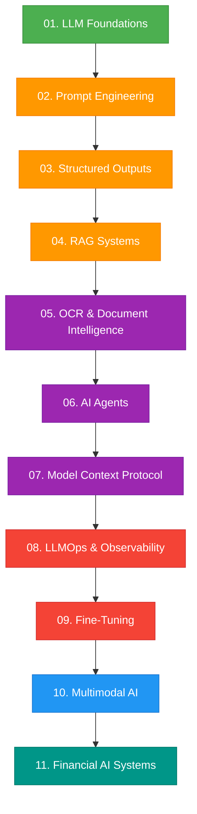

# Roadmap & Module Progression

This page outlines the curriculum and sequential projects designed to build deep, production-grade expertise in AI systems.

---

## 🗺️ Learning Path

The roadmap is structured sequentially. Each module serves as a mathematical or architectural foundation for the next.

---

## 📊 Module Classification & Complexity

To optimize the learning curve, each topic is classified by difficulty level and estimated duration.

| Module | Topic | Difficulty | Est. Timeline | Focus Area |
| :--- | :--- | :---: | :---: | :--- |
| **01** | Foundations & Math of LLMs | 🟢 Easy | 2 weeks | BPE/WordPiece, Embedding Space, Attention Blocks |
| **02** | Prompt Engineering | 🟢 Easy | 1 week | Few-shot, COT, XML/JSON schemas |
| **03** | Structured Outputs | 🟢 Easy | 1 week | Pydantic validation, Instructor, Guardrails |
| **04** | RAG (Retrieval-Augmented) | 🟡 Medium | 3 weeks | Hybrid Search, Chunking, Re-ranking, Vector DBs |
| **05** | OCR & Parsing | 🟡 Medium | 2 weeks | Unstructured data extraction, Docling, LayoutLM |
| **06** | AI Agents & State Machines | 🟠 Hard | 4 weeks | LangGraph, Reasoning loops, Memory, Orchestration |
| **07** | MCP (Model Context Protocol) | 🟠 Hard | 2 weeks | API endpoints, Secure tool sandboxing, Tool Registry |
| **08** | LLMOps | 🔴 Expert | 4 weeks | Monitoring (Phoenix, LangSmith), Security, Evals |
| **09** | Fine-Tuning | 🔴 Expert | 3 weeks | LoRA, QLoRA, PEFT, Distillation |

---

## 🧭 Project Architecture Principles

Every project implemented throughout this roadmap must strictly adhere to the following delivery standards:
- **Zero Placeholder Code:** All APIs, data structures, and tests must be complete and executable.
- **Strict Linting & Formats:** Pre-commit checks via Black, Isort, and Ruff must pass seamlessly.
- **Robust Verification:** Every module must contain reproducible benchmark scripts and at least 90% pytest unit test coverage.
- **Clean Documentation:** Code rationales, mathematical proofs, and trade-off considerations must be logged inside the respective module's `README.md`.
